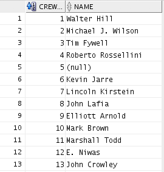
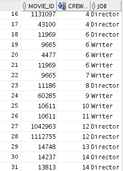
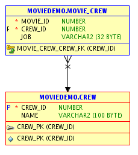
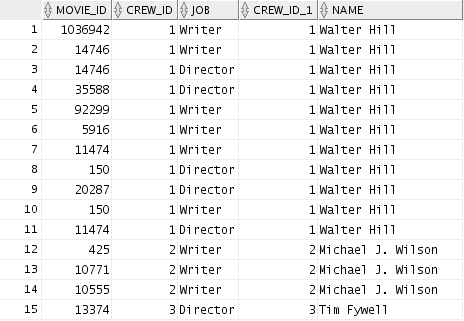

# A relational state of mind

Compared to the data you might be used to analyze in school, database tables are usually written to regularly, so that the amount of data in the table grows. Perhaps it is also designed to have data regularly deleted or updated, as data stops being valid, relevant or correct.

This need to write governs one of the most important principles of table structure: *Adding more data should result in more rows, never more columns*.

Let's illustrate this with an example: A major news website lets users sign up and choose subjects they are interested in. Since any user can choose an arbitrary number of subjects, there is no way for the database designers to anticipate the maximum number subjects that a user will choose and create that number of columns. Doubling down and creating one column for each topic is probably not a good idea either, as editors are likely to add and remove topics as they see fit. Instead, they would probably choose to create a new table, containing only user-IDs and topics. Here, a user would have one row for every topic she liked, and the developers won't have to constantly alter the database tables.

Splitting data into multiple tables is also the solution to another database principle: *Don't duplicate information*.

Say for example you are storing information about employees and their employers. When it's time to analyze the data, you probably want a single table containing columns such as employee ID, employee title, salary and tenure, along with columns such as number of employees in company, market value, CEO pay, etc. Employer information would be repeated for every employee in the same company. From a database perspective, that repetition would be unfortunate. Not only does it take up additional space, but it would enable inconsistencies in the data. The same company could accidentaly be stored with two different market values, and it would be impossible for us to know which is correct. Again, the solution is to split employer data into a separate table, and only store an employer-ID in the employee table.

When integrating different types of data, these principles can quickly manifest themselves in a giant maze of tables with not just one but many links between them. It is often useful to visualize entire database structure in an ER-diagram in order to get a high-level overview of the tables, columns and connections between the tables. The IDs connecting the tables might be entirely fictional number sequences, and in database jargon these ID columns are referred to as *keys* and *foreign keys*. In our example, the employer ID stored in the employee table would be a *foreign key* because it refers to a column in the employer table that is designed to identify a single employer.

In a random dataset created for analysis purposes, defining what makes a row uniquely identifiable might be completely irrelevant. For database developers, it is second nature to require a unique identifier for every row in a table. If the data does not have one, a new ID column might be created simply to have that uniqueness. The IDs would be a meaningless sequence of numbers, but it would be a unique identifier and referred to as a *primary key* because it singlehandedly identifies every row in the table uniquely.

## An illustrated example with movie-data

The VM comes with a collection of tables relating to movies. One table describes the movies themselves, another table describes actors etc, and a third table contains the connections between the actors and the movies. Here are the `crew` and `movie_crew` tables respectively:

This type of data is referred to as "Normalized data". There are many versions of normalization and experts may have bitter arguments about the details, but the most important term to remember might be "third normal form", which (despite its ridiculous name) refers to what most people would say is a "common sense" split of the data in order to avoid data duplication (more on the third normal form on Wikipedia: https://en.wikipedia.org/wiki/Third_normal_form). The reason the tables are split like this, are of course that one actor can appear in several movies. The relationship between the two tables can be illustrated in an ER (entity relation) diagram:

The three lines going from `movie_crew` converging to a single arrow pointing to `crew` indicates that several rows in the `movie_crew` table can point to a single row in the `crew` table - consistent with the fact that one actor or director can be involved in several movies. If we were to store all this information in a single table, we would have to repeat people's names as they appear in several movies. Such information duplication is both expensive (in terms of storining duplicate information) and risky in the sense that it becomes more difficult to know if two names refer to the same person.

When reading and analyzing data, so-called "denormalized" data might be more useful. Denormalization can easily be achieved by joining the data tables (more on this in chapter 6).

